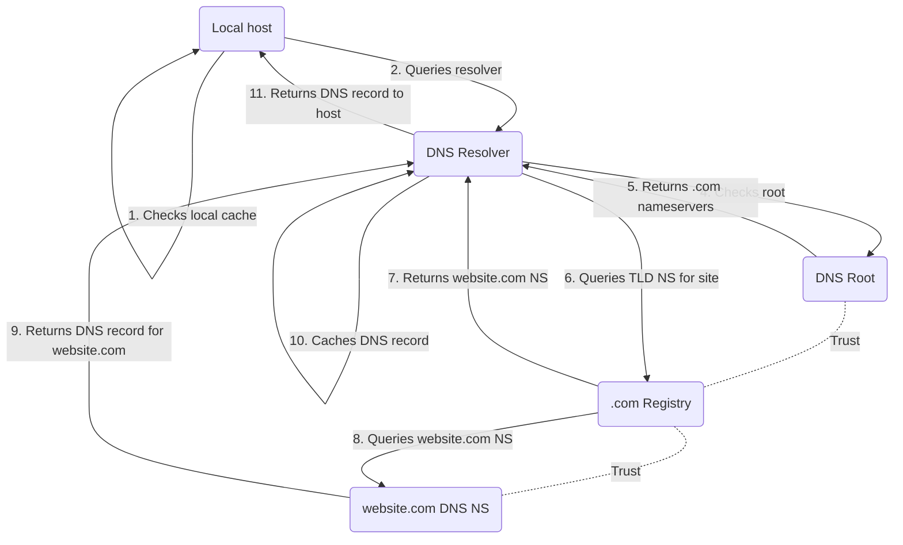
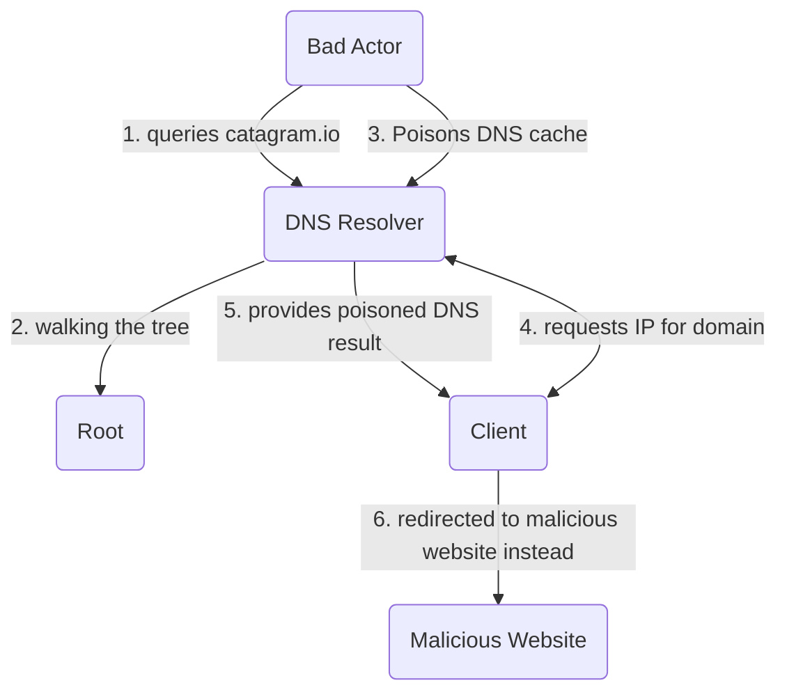
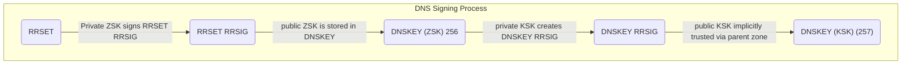

>[!Abstract] DNS Basics
> - Very simply: DNS is like a database/table converting human-readable names (e.g. www.netflix.com) to IP addresses
> - Allows people to use names to access websites instead of having to memorize IPs

>[!Definition] DNS Terms
> - DNS Zone: database containing records (e.g. \*.netflix.com)
> - ZoneFile: file that stores the zone on disk
> - Host File: static mapping of names to IPs; overrides DNS
> - Name Server (NS): DNS server that hosts 1 or more zones and 1 or more zone files
> - Authoritative: source of truth for DNS records
> - Non-authoritative: stores cached DNS records/zones for quick retrieval

## Why a Complex Architecture?

- Addresses several issues:
	- Scaling issues
		- Millions of websites, millions of requests = more servers required
	- Availability issues
		- Large # of requests require large # of servers

## Hierarchical Design

1. DNS Root
	1. Stores only basic info on top-level domains (TLDs)
2. Top Level Domains (TLDs)
	1. Registrars manage registration/membership for .com, .edu, etc
3. Authoritative Name Servers
	1. Provides query response for DNS requests
4. Zone & ZoneFile
	1. store zone records for the domain

## Walking the Tree

>[!Warning] Important Points
> - No single NS has all answers
> - Every query gives the next step
> - Entire process is called "walking the tree"



## Registering a New Domain

>[!Warning] 
> - Registrars and hosting provider can be the same or different companies
> - Route 53 hosted zones need to be pointed at from TLD via Route 53 registered domains

```mermaid
flowchart

A(Individual) -- 1. pays for cats.com --> B(domain registrar)
B --> C{Registrar also host?} --> D(No) -- 2a. Ask for NS info --> F(DNS Host) -- Supplies NS info --> B
C --> E(Yes) -- 2b. Create zone, Get NS --> B
B -. 3. Register domain, supply NS info .-> G(TLD Registry)
G -. 4. add cats.com NS to .com TLD zone .-> H(TLD Zone)
```

## DNSSEC

>[!Abstract] Benefits of DNSSEC
> - Data Origin Authentication: verifies authenticity of zone data
> - Data Integrity Protection: ensures data hasn't been modified in transit
> - Establishes chain of trust between DNS root zone and DNS records
> - Uses public key cryptography to secure DNS
> - Additive to DNS; not a replacement

>[!Warning]
> - In a valid scenario, both DNS and DNS+DNSSEC return the same results
> 	- DNSSEC requests will return both DNS and DNSSEC results
> - If DNS is exploited, it will be unaware of invalid/compromised records
> 	- DNSSEC will be aware of invalid/compromised records

## Poisoned DNS Cache Example

>[!Warning]
>A poisoned cached result will be used to respond to all catagram.io queries until TTL expiration



- `dig www.google.com` - command to return DNS results
- `dig www.google.com +dnssec` - command to return DNS + DNSSEC results

### How DNSSEC Works

#### Resource Record Set - RRSET

>[!Definition] RRSET
> - Groupings of records of the same name and type, e.g. sets of CNAME records, sets of A (IPv4) records, sets of AAAA (IPv6) records, sets of MX records, etc
> - Allow verification of integrity of record sets

- RRSIG: stores a digital signature of an RRSET using public and private keypairs
- Zone Signing Key (ZSK): public and private keypairs

>[!Warning] 
> - If RRSET changes, the RRSIG must be regenerated. Unauthorized changes produce an invalid signature. Private Zone Signing Key (ZSK) is required
> - The above assumes the DNSKEY (ZSK) is trusted


#### DNSKEY

>[!Definition] DNSKEY
>The DNSKEY contains public keys and key signing key (KSK) required to verify all RRSIGS for a specific zone

>[!Warning]
>DNSKEY contains its own RRSIG, which can be validated only by the key signing key (KSK)

- DNSSEC Resolver can verify integrity (authenticity) of RRSET using RRSIG and DNSKEY together
	- This assumes the DNSKEY (ZSK) can be trusted

#### Key Signing Key (KSK)

>[!Warning] Key Points
> - DNSKEY (KSK) is the point of trust for the zone
> - Sub zone is linked to parent zone via cryptographic trust
> - ZSK alone would require parent zone changes when rolling keys
> - KSK links to parent zone, allowing ZSK rollovers without requiring parent zone changes



#### Chain of Trust

>[!Definition] DS Records
>DS Records store a hash of the child domains from the public KSK, e.g. links the parent trust to the child

#### Validation Flow

This part is very confusing, will revisit later