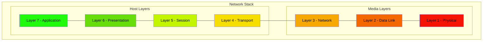
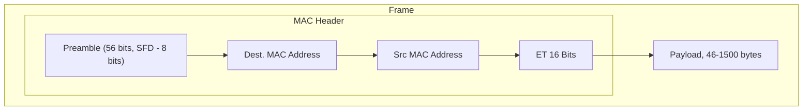

## OSI Model

## Layer 1 - Physical

>[!Definition] Layer 1 - Physical
>Specifications that define the transmission and reception of raw bit streams between a device and a shared physical medium. Defines voltage levels, timing, rates, distances, modulation, and connectors

### Overview
- Physical shared medium
- Standards for transmitting
- Standards for receiving
- No access control
- No uniquely identified devices
- No device-to-device communication

- Piece of cable to transfer signals (copper, fiber, wifi)
	- Copper: certain voltage is considered binary 1, another voltage is binary 0
- Hub
	- anything received on any port is transmitted to every other port, including errors/collisions
	- No device addressing; all data is processed by all devices
	- L1: no media access control and no collision detection

## Layer 2 - Data Link

>[!Definition] Layer 2 - Data Link
>Identifiable devices
>Media access control (MAC) addressing
>Collision detection
>Supports Unicast (one-to-one) and broadcast (1-to-many) comms

### Overview

- Layer 2 provides frames (encapsulation) that is converted into voltages, light, or WiFi for the physical medium in Layer 1

- L2 devices have a unique hardware (MAC) address
	- 48 bits in hex, 24 bits for manufacturer
	- Frames can be addressed to destination or broadcast

### Frame Anatomy

- Payload: data the frame carries from source to destination
	- Provided by Layer 3
	- EtherType (ET) attribute defines which L3 protocol is used (e.g. IP)
- CSMA/CD: Carrier Sense Multiple Access/Collision Detection
	- Detects a carrier, sends to layer 1 device if no carrier

#### Layer 2 Devices
- Switch
	- Similar to a hub but "smart"
	- Store and forward only valid frames
	- Collisions are limited to specific ports only
	- Maintains a MAC address table to send/receive frames to devices

## Layer 3 - Network Layer

>[!Definition] Layer 3 - Network Layer
>Provides:
>	IP Addressing (IPv4/v6) - cross network addressing
>	ARP - finds the MAC address for a specific IP
>	Routing - where to forward a packet
>	Route Tables - indexing multiple routes for faster resolution
>	Router - moves packets from SRC to DST. Encapsulates in L2 along the way
>	Device to Device comms over the internet
>Does not provide:
>	Methods for multiple channels of comms; supports SRC IP to DST IP only
>	Can be delivered out of order

### Overview

- Adds the IP protocol
- Allows assigning of IP addresses
- Allows different Layer 2 protocols to communicate with each other

#### Layer 3 Routers/devices
- Remove extant frame encapsulation and add a new frame encapsulation at every hop
- IP packets are moved from source to destination via intermediate networks, encapsulated in different frames along their journey

#### Internet Protocol (IP)
- Layer 3 protocol, adds cross-network IP addressing and routing
- Allows data to move between LANs without direct P2P links
- Key pieces of an IPv4 packet:
	- Protocol
	- Source IP
	- Destination IP
	- Time to Live (TTL)
	- Data (provided by Layer 4)
- Key pieces of an IPv6 packet:
	- Source IP
	- Destination IP
	- Data (provided by Layer 4)
	- Hop Limit

>[!Important] 
>When an ISP is forwarding a packet to an AWS router, the forwarding is occurring at [[Network Starter Pack#Layer 2 - Data Link|Layer 2]]

## IPv4

- Uses dotted decimal notation
	- *e.g. 133.33.33.7*
- Contains a network part and host part
	- Network part: first two octets (e.g. 133.33)
	- Host part: last two octets (e.g. 33.7)

#### Subnet Mask

>[!Important] Subnet Mask
>The subnet mask allows a host to determine if an IP address it needs to communicate with is local or remote, which influences whether it uses a gateway or can communicate locally

- Subnet mask for a /16 network is $255.255.0.0$
	- Makes sense when converted to decimal: 8 1s in the first octet, 8 1s in the second octet, 0s for last two octets
	- $11111111.11111111.00000000.00000000$
- E.g. the subnet mask for a /21 network would be:
	- binary: $11111111.11111111.11111000.00000000$
	- subnet mask: $255.255.248.0$
- To calculate the number of addresses for each network, just subtract 32 from the prefix then take 2 to that power, e.g. with /16:
- $32-16=16$
- $2^{16}-2=65,534$
	- Always subtract 2 for the reserved network and broadcast addresses

## Address Resolution Protocol (ARP)

- Process that runs between Layer 2 and Layer 3
	- Broadcasts on Layer 2
	- Layer 2 is used for communications on a local network
- Discovers which MAC belongs to a given a IP

![[Pasted image 20221117133313.png]]

## Layer 4 - Transport

>[!Definition] Layer 4 - Transport Overview

- Adds Transmission Control Protocol (TCP) and User Datagram Protocol (UDP)
	- TCP
		- used for HTTP, HTTPS, SSH, and other protocols that require reliable communication
		- Uses a handshake to establish communication
		- Prioritizes reliability
	- UDP
		- Does not contain same handshake/verification process of TCP
		- Less reliable than TCP, but faster since no handshake overhead exists
		- Prioritizes performance
	- Both run on top of IP itself

### TCP

- Segments
	- Segments are encapsulated within IP packets
- TCP Header Structure
	- Source Port
	- Destination Port
	- Sequence Number
	- Acknowledgement (ACK)
	- Flags n' Things
	- Window
	- Checksum
	- Urgent Pointer
	- Options
	- Padding
	- Data
- Well-known port: a port that is used as a standard channel for communications between devices
- Ephemeral port: a higher numbered port that is used as a temporary channel for communications, usually between a well-known port
- Both ports are why you need two sets of rules for ACLs in AWS
- Flags 'n Things
	- URG
	- ACK
		- acknowledges connection
	- PSH
	- RST
	- SYN
		- synchronizes sequence numbers
	- FIN
		- used for closing a connection

### 3-Way Handshake Process

![[Pasted image 20221117140556.png]]

### Sessions & State

- Stateless firewall (Network ACL)
	- Requires an outbound rule and a response rule (two rules)
- Stateful firewall
	- Understands the 'state' of the TCP segments at Layer 4
	- Response traffic is implicitly allowed by initial traffic
		- This is how security groups in AWS work

## Network Address Translation (NAT)

>[!Definition] NAT - Overview
> Designed to overcome shortages of IPv4 addresses (not applicable to IPv6)
> Provides some additional security
> Translates private IPv4 addresses to public
> Static NAT - 1 private to 1 fixed, public address
> Dynamic NAT - 1 private to 1st available public address
> Port Address Translation (PAT) - many private to 1 public (used in home networks and AWS network gateway)

### Static NAT

- This is how the AWS Internet Gateway works
![[Pasted image 20221117142332.png]]
