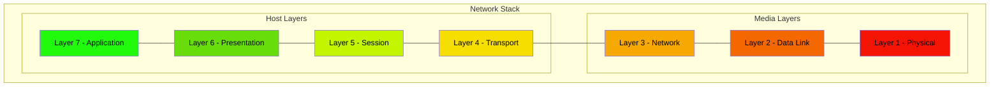

## OSI Model

```mermaid
graph TD
	subgraph top [Network Stack]
		subgraph A1 [Host Layers]
		A[Layer 7 - Application]
		--- B[Layer 6 - Presentation]
		--- C[Layer 5 - Session]
		--- D[Layer 4 - Transport]
		end
		
		subgraph A2 [Media Layers]
		D --- E[Layer 3 - Network]
		--- F[Layer 2 - Data Link]
		--- G[Layer 1 - Physical]
		end
	end

    style G fill:#F51304,color:#000
    style F fill:#F56700,color:#000
    style E fill:#F5A901,color:#000
    style D fill:#F5DE00,color:#000
    style C fill:#C1F500,color:#000
    style B fill:#67DE0B,color:#000
    style A fill:#21FA0D,color:#000
```

